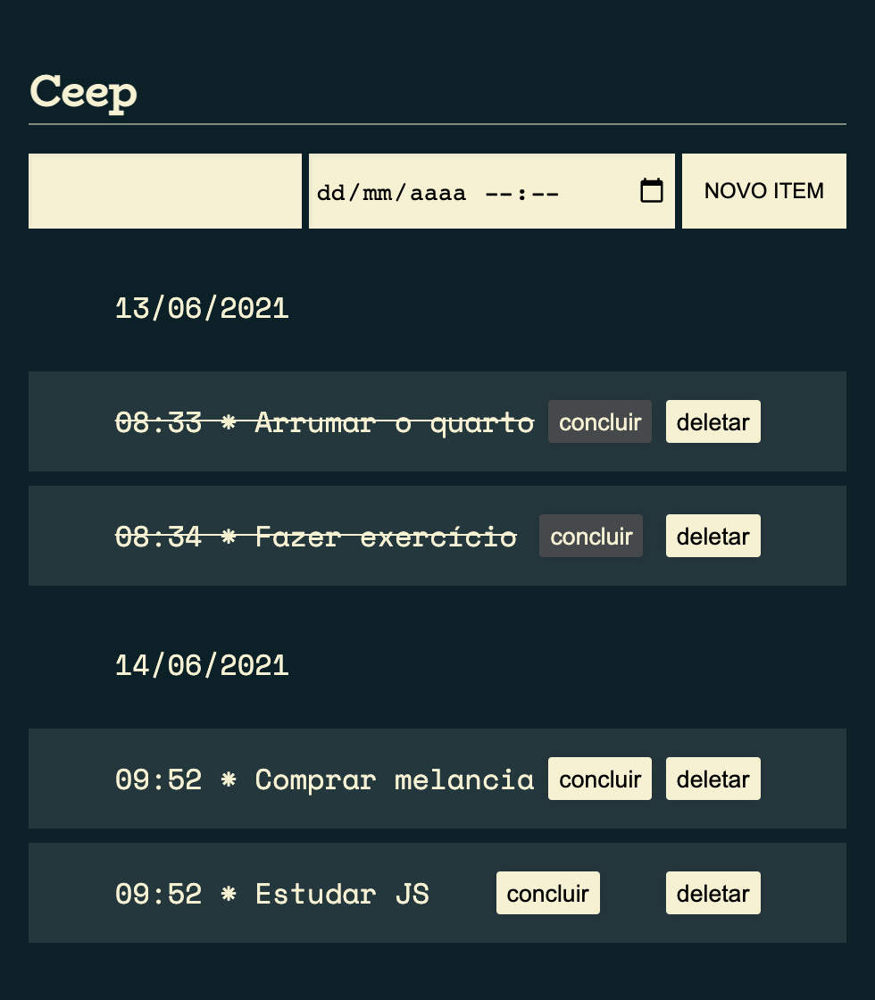

<h1 align="center">📝 CEEP</h1>

<p>CEEP é uma lista de tarefas gerada dinâmicamente no qual o usuário descreve uma tarefa que deseja cumprir e insere a data e horário de criação. Quando for finalizada ele pode clicar no botão de concluir e assim a tarefa ficará riscada, silizando a conclusão. Também há um botão de exclusão, caso o usuário queira remover uma tarefa da lista.</p>

<p align="center">
  <a href="#status">Status do Projeto</a> |
  <a href="#execute">Como Executar</a> |
  <a href="#tecnologys">Tecnologias Utilizadas</a> |
  <a href="#structure">Estrutura</a> | 
  <a href="#features">Features</a>
</p>

<div align="center">

</div>

<h2 id="status">✅ Status do Projeto</h2>

<p>Concluído</p>

</br>

<h2 id="execute">🚀 Como Executar</h2>
<p>Clonar ou fazer o Download ZIP do projeto</p>
<p>Instalar o LiveServer:

```sh
npm install -g live-server
```

Execute o projeto:

```sh
live-server .
```

</br>

<h2 id="tecnologys">📌 Tecnologias Utilizadas</h2>

<p>As seguintes ferramentas foram usadas na construção do projeto:</p>

<p> 🎲 <strong>HTML5</strong></p>
<p> 🎲 <strong>CSS3</strong></p>
<p> 🎲 <strong>JavaScript</strong></p>

<br/>

<h2 id="structure">🌳 Estrutura do projeto</h2>

```sh
├── README.md
├── assets
│   ├── css
│   │   └── style.css
│   └── images
│       └── ceep.png
├── components
│   ├── carregaTarefa.js
│   ├── concluiTarefa.js
│   ├── criaData.js
│   ├── criaTarefa.js
│   └── deletaTarefa.js
├── index.html
├── main.js
└── service
    └── data.js
```

</br>

<h2 id="features">🛠️ Features</h2>

<p>🔧 Criar lista de tarefa com data e hora</p>
<p>🔧 Tarefas ficam salvas e marcadas como conlcuídas mesmo fechando o navegador</p>
<p>🔧 Marcar tarefa como concluída</p>
<p>🔧 Deletar tarefa</p>
